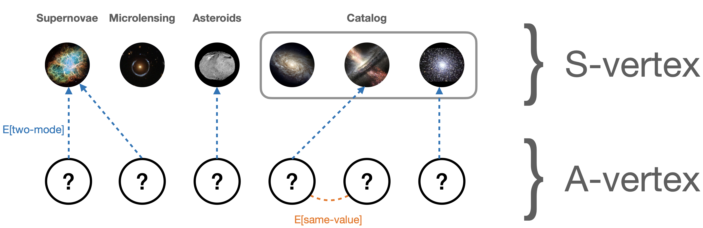

# TestJGraph7 exploration

[2020/08/24] In this note, I explore the `TestJGraph7` table. I use the grafink-shell whenever possible from my laptop (using sshuttle to connect to the remote table). I just updated the configuration file

```diff
+     host: "hbase-1.lal.in2p3.fr"
---
-     host: "127.0.0.1"
```

and simply launch the shell

```bash
./bin/grafink-shell --config conf/application.conf
...
grafink> g.V()

```

I sometimes encountered difficulty to use gremlin java API (either limitation in the language, or just lack of documentation to write queries), hence I sometimes fall back to standard gremlin shell.

```bash
/path/to/janusgraph/bin/gremlin.sh
gremlin>  graph = JanusGraphFactory.build().set("storage.backend", "hbase").set("storage.hostname", "xx.xx.xx.xx").set("storage.hbase.table", "TestJGraph7").open()
==>standardjanusgraph[hbase:[xx.xx.xx.xx]]
gremlin> g = graph.traversal()
==>graphtraversalsource[standardjanusgraph[hbase:[xx.xx.xx.xx]], standard]
```

In the following, the default shell is `grafink` but queries starting with `gremlin>` means I am using the default gremlin shell.

## The graph



The graph is made of 472,782 vertices

```java
grafink>g.V().count()
477314
```

There are two types of vertices:

- alert vertices, aka A-vertices (477,279)
- similarity vertices, aka S-vertices (35)

An A-vertex represents an alert from ZTF. It has 15 properties:

```java
// Let's take A-vertex 68062208
grafink>g.V("68062208").valueMap(true).next().asScala.foreach(println)
(id,68062208)
(label,alert)
(rfscore,[0.374])
(snn_snia_vs_nonia,[0.7637328505516052])
(mulens_class_1,[])
(mulens_class_2,[VARIABLE])
(cdsxmatch,[EB*])
(roid,[0])
(classtar,[0.725])
(objectId,[ZTF18aaacpwn])
(rowkey,[ZTF18aaacpwn_2458795.0381597])
(candid,[1040538151415010019])
(jd,[2458795.0381597])
(magpsf,[18.081629])
(sigmapsf,[0.091008104])
```

A S-vertex represents a category in the dataset, based on A-vertex properties. There are 4 main S-vertices:

| S-vertex | recipe | # outgoing edges
|---|----|-----|
| supernova | (`rfscore` AND `snn_snia_vs_nonia`) > 0.9 | 0
| microlensing | `mulens_class_i == ML` | 5,916
| asteroids | `roid` >= 2 | 64,990
| catalog | `cdsxmatch` | 88,121

_Table 1: Definition of S-vertices based on A-vertex properties, and number of A-vertices connected to each S-vertex._

## TwoModeClassifier

A-vertices are not directly connected between them. They are instead connected to S-vertices that represent special categories of alerts: `microlensing`, `supernova`, `asteroids` or `catalog`. To see what similarity vertices are available, just run:

```java
g.V().has("recipe").valueMap()
==>[recipe:[supernova]]
==>[recipe:[microlensing]]
==>[recipe:[asteroids]]
==>[recipe:[catalog],equals:[WD*]]
==>[recipe:[catalog],equals:[Cepheid]]
...
```

Each S-vertex has 3 or 4 properties:

```java
grafink>g.V().has("recipe", "microlensing").valueMap(true).next().asScala.foreach(println)
(id,512)
(label,similarity)
(recipe,[microlensing])

grafink>g.V().has("recipe", "catalog").has("equals", "EB*").valueMap(true).next().asScala.foreach(println)
(id,8704)
(label,similarity)
(recipe,[catalog])
(equals,[EB*])
```


An edge is made between a A-vertex and a S-vertex if the condition of the recipe is satisfied (see Table 1). You can check how many A-vertices are connected to each S-vertex:

```java
gremlin> g.V().has("recipe", "microlensing").outE().count()
==>5916
gremlin> g.V().has("recipe", "supernova").outE().count()
==>0
gremlin> g.V().has("recipe", "asteroids").outE().count()
==>64990
gremlin> g.V().has("recipe", "catalog").outE().count()
==>88121
```

The biggest S-vertex is the `catalog` (object previously catalogued). We can see that the `supernova` S-vertex does not have any connection in the data set. We might need to revisit the recipe.

### The special case of catalog

The S-vertex `catalog` is a large category that contains many subcategories. The recipe is based on the A-vertex property `cdsxmatch`, that is the result of the cross-match with the Simbad catalog at CDS. To see all available subcategories:

```java
grafink>g.V().has("recipe", "catalog").valueMap(true).fold().next().asScala
res32: collection.mutable.Buffer[java.util.Map[Object, Nothing]] = ArrayBuffer(
  {id=1024, label=similarity, recipe=[catalog], equals=[WD*]},
  {id=1280, label=similarity, recipe=[catalog], equals=[Cepheid]},
  {id=1536, label=similarity, recipe=[catalog], equals=[EllipVar]},
  {id=1792, label=similarity, recipe=[catalog], equals=[AGN]},
  {id=2048, label=similarity, recipe=[catalog], equals=[C*]},
  {id=2304, label=similarity, recipe=[catalog], equals=[DwarfNova]},
  {id=2560, label=similarity, recipe=[catalog], equals=[AMHer]},
  {id=2816, label=similarity, recipe=[catalog], equals=[Blazar]},
  {id=3072, label=similarity, recipe=[catalog], equals=[Candidate_TTau*]},
  {id=3328, label=similarity, recipe=[catalog], equals=[TTau*]},
  {id=3584, label=similarity, recipe=[catalog], equals=[Radio]},
  {id=3840, label=similarity, recipe=[catalog], equals=[Galaxy]},
  {id=4096, label=similarity, recipe=[catalog], equals=[Candidate_YSO]},
  {id=4352, label=similarity, recipe=[catalog], equals=[YSO]},
...
```

We can explore the most represented subcategories:

```java
gremlin> g.V().has("recipe", "catalog")
	.group().by("equals")
	.by(out("satr").count())
	.order(local).by(values,decr)
==>[RRLyr:23782,EB*:19881,Star:15787,Mira:6861,LPV*:6259,QSO:2914,C*:2467,
V*:1934,Seyfert_1:1336,YSO:1174,Em*:699,Orion_V*:680,BLLac:662,
Candidate_YSO:477,DwarfNova:477,CataclyV*:470,Galaxy:427,TTau*:389,
S*:377,SN:218,PulsV*delSct:207,Radio:164,AGN:153,Cepheid:86,AMHer:74,
WD*:60,EllipVar:32,Candidate_TTau*:26,Candidate_SN*:20,Blazar:20,Flare*:8]
```

With no surprises, `RRLyr` and `EB*` are the most represented (Variable stars). The most seen objects in the `EB*` class are for example:

```java
gremlin> g.V().has("recipe", "catalog").has("equals", "EB*")
	.outE().inV()
	.has("objectId")
	.groupCount().by("objectId")
	.order(local).by(values,decr)
==>[ZTF18abcqled:15,ZTF17aacrvth:13,ZTF17aaaskzj:13,ZTF17aaasnqh:13,
ZTF17aaadvbq:12,ZTF18aaiokvu:12,ZTF18aazmwuk:12,ZTF17aaafghz:12,
ZTF18abmexoh:11,ZTF17aaaehrb:11,ZTF17aaaxapz:11,ZTF18aaadsuj:10,
ZTF18aaadtoc:10,ZTF18aaadrqb:10,ZTF18aabfawx:10,ZTF18aaadskw:10,
ZTF17aabupda:10,ZTF18abvlghe:10,ZTF18abomibn:10,ZTF18abncrjv:10...
```

## SameValueClassifier

In addition to the `TwoModeClassifier`, we can link A-vertex between them directly using an exact match on one property (`SameValueClassifier `). This is currently done on the `objectId` property which represents all A-vertex from the same astrophysical object:

```java
gremlin> g.V().has("objectId", "ZTF18aaacpwn").fold()
==>[v[57424640],v[68062208],v[80266496],v[80283904],v[88313856]]
```

Then you can check all connections for these objects:

```java
gremlin> g.V().has("objectId", "ZTF18aaacpwn").outE()
==>e[44efv9c-y6t4w-fth-6ps][57424640-satr->8704]
==>e[4aj64n4-y6t4w-hed-14it4w][57424640-exactmatch->68062208]
==>e[47tewow-y6t4w-hed-1bse0w][57424640-exactmatch->80266496]
==>e[47texhc-y6t4w-hed-1bsrgg][57424640-exactmatch->80283904]
==>e[46gmk8w-y6t4w-hed-1gkveo][57424640-exactmatch->88313856]
==>e[43804cg-14it4w-fth-6ps][68062208-satr->8704]
==>e[4aj648w-14it4w-hed-y6t4w][68062208-exactmatch->57424640]
==>e[4aj651c-14it4w-hed-1bse0w][68062208-exactmatch->80266496]
==>e[4aj65ts-14it4w-hed-1bsrgg][68062208-exactmatch->80283904]
==>e[4aj63gg-14it4w-hed-1gkveo][68062208-exactmatch->88313856]
==>e[3zqor9c-1bse0w-fth-6ps][80266496-satr->8704]
==>e[47tex34-1bse0w-hed-y6t4w][80266496-exactmatch->57424640]
==>e[4aj65fk-1bse0w-hed-14it4w][80266496-exactmatch->68062208]
==>e[49upb0g-1bse0w-hed-1bsrgg][80266496-exactmatch->80283904]
==>e[46gml1c-1bse0w-hed-1gkveo][80266496-exactmatch->88313856]
==>e[42l3rb4-1bsrgg-fth-6ps][80283904-satr->8704]
==>e[47texvk-1bsrgg-hed-y6t4w][80283904-exactmatch->57424640]
==>e[4aj6680-1bsrgg-hed-14it4w][80283904-exactmatch->68062208]
==>e[49upbeo-1bsrgg-hed-1bse0w][80283904-exactmatch->80266496]
==>e[46gmlts-1bsrgg-hed-1gkveo][80283904-exactmatch->88313856]
==>e[3yyf9xc-1gkveo-fth-6ps][88313856-satr->8704]
==>e[46gmjuo-1gkveo-hed-y6t4w][88313856-exactmatch->57424640]
==>e[4aj63uo-1gkveo-hed-14it4w][88313856-exactmatch->68062208]
==>e[46gmkn4-1gkveo-hed-1bse0w][88313856-exactmatch->80266496]
==>e[46gmlfk-1gkveo-hed-1bsrgg][88313856-exactmatch->80283904]
```

They are all linked through them via the `SameValueClassifier` (exactmatch), and they are linked to the same S-vertex (8704) via the `TwoModeClassifier`:

```java
// this is the similarity vertex EB*
gremlin> g.V(8704).valueMap()
==>[recipe:[catalog],equals:[EB*]]
```

### Combining the two classifiers to find classifier errors

One interesting application of the graph is to find errors during classification by the Fink science modules. Let's take an example. There are 15 A-vertices with `objectId` ZTF18abcqled


```java
gremlin> g.V().has("objectId", "ZTF18abcqled").count()
==>15
```

They all have a `cdsxmatch` equals to `EB*`:

```java
gremlin> g.V().has("objectId", "ZTF18abcqled").values("cdsxmatch").fold()
==>[EB*,EB*,EB*,EB*,EB*,EB*,EB*,EB*,EB*,EB*,EB*,EB*,EB*,EB*,EB*]
```

But if we check the S-vertices linked to these alerts, not only we find the `catalog/EB*` but also `microlensing`:

```java
gremlin> g.V().has("objectId", "ZTF18abcqled")
	.outE().has("weight")
	.inV().dedup().valueMap()
==>[recipe:[microlensing]]
==>[recipe:[catalog],equals:[EB*]]
```

So who is right? Are those alerts emitted from a variable star of type `EB*` or from a microlensing event? Let's have a closer look at the microlensing score:

```java
grafink>
g.V().has("objectId", "ZTF18abcqled")
	.order().by("jd")
	.valueMap(true, "mulens_class_1", "mulens_class_2", "jd")
	.asScala.toList.map(println)
{id=85554176, label=alert, mulens_class_1=[VARIABLE], mulens_class_2=[VARIABLE], jd=[2458789.6273958]}
{id=12977408, label=alert, mulens_class_1=[VARIABLE], mulens_class_2=[VARIABLE], jd=[2458789.6553588]}
{id=17302784, label=alert, mulens_class_1=[VARIABLE], mulens_class_2=[VARIABLE], jd=[2458789.6563542]}
{id=2764800, label=alert, mulens_class_1=[ML], mulens_class_2=[ML], jd=[2458789.6796991]}
{id=8956928, label=alert, mulens_class_1=[VARIABLE], mulens_class_2=[VARIABLE], jd=[2458789.7594329]}
{id=115490560, label=alert, mulens_class_1=[ML], mulens_class_2=[ML], jd=[2458790.6415162]}
{id=95453440, label=alert, mulens_class_1=[VARIABLE], mulens_class_2=[VARIABLE], jd=[2458790.6419792]}
{id=17386496, label=alert, mulens_class_1=[VARIABLE], mulens_class_2=[VARIABLE], jd=[2458790.643912]}
{id=85813760, label=alert, mulens_class_1=[VARIABLE], mulens_class_2=[VARIABLE], jd=[2458790.643912]}
{id=104697088, label=alert, mulens_class_1=[VARIABLE], mulens_class_2=[VARIABLE], jd=[2458791.7564931]}
{id=63058176, label=alert, mulens_class_1=[VARIABLE], mulens_class_2=[VARIABLE], jd=[2458791.7597338]}
{id=102200832, label=alert, mulens_class_1=[ML], mulens_class_2=[ML], jd=[2458792.6595718]}
{id=19882752, label=alert, mulens_class_1=[VARIABLE], mulens_class_2=[VARIABLE], jd=[2458793.6064236]}
{id=39941376, label=alert, mulens_class_1=[VARIABLE], mulens_class_2=[VARIABLE], jd=[2458793.7033449]}
{id=80708352, label=alert, mulens_class_1=[VARIABLE], mulens_class_2=[VARIABLE], jd=[2458793.7057523]}
```

So 3 alerts are connected to the S-vertex `microlensing`: 2764800, 115490560, and 102200832. They pop up randomly (not in sequence), so most likely the microlensing identification is wrong.


## Limitations encoutered:

If the query is too broad (full scan), the server returns `UnknownScannerException`:

```java
grafink>g.V().hasLabel("recipe").count()
...
Caused by: org.apache.hadoop.hbase.ipc.RemoteWithExtrasException(org.apache.hadoop.hbase.UnknownScannerException): 
org.apache.hadoop.hbase.UnknownScannerException: Unknown scanner '3123526227420260693'. 
This can happen due to any of the following reasons: 
a) Scanner id given is wrong, 
b) Scanner lease expired because of long wait between consecutive client checkins, 
c) Server may be closing down, 
d) RegionServer restart during upgrade.
If the issue is due to reason (b), a possible fix would be increasing the value of'hbase.client.scanner.timeout.period' configuration.
```

## Suggestions for improvement

This new version of the graph is excellent. I think we should continue in this direction. Here are a few additions and modifications that should be done to improve the data:


### Addition of new A-vertex properties

We should add these new properties (I quote their name from the Parquet dataset):

- `candidate.ndethist` (int)
- `candidate.ra` (float)
- `candidate.dec` (float)
- `candidate.drb` (float)
- `candidate.ssdistnr` (float)
- `candidate.ssnamenr` (string or null)
- `candidate.fid` (int)
- `candidate.neargaia` (float or null)
- `candidate.distpsnr1` (float or null)
- `snn_sn_vs_all` (float)
- `mulens.ml_score_1` (float)
- `mulens.ml_score_2` (float)

And we should finish to add all `catalog` subcategories.

### Modification of the supernova recipe

The current supernova recipe is leading to zero links. I propose to change to:

```
snn_snia_vs_nonia > 0.75
AND
snn_sn_vs_all > 0.75
AND
drb > 0.5
AND
cdsxmatch in either 
	["galaxy", "Galaxy", "EmG", "Seyfert", "Seyfert_1", "Seyfert_2", 
	"BlueCompG", "StarburstG", "LSB_G", "HII_G", "High_z_G", "GinPair", 
	"GinGroup", "BClG", "GinCl", "PartofG", "Unknown", 
	"Candidate_SN*", "SN", 	"Transient"]
AND
ndethist < 400
AND
classtar > 0.4
```

This should give about 2,444 A-vertices connected to the S-vertex supernova for the same period of time than this study.